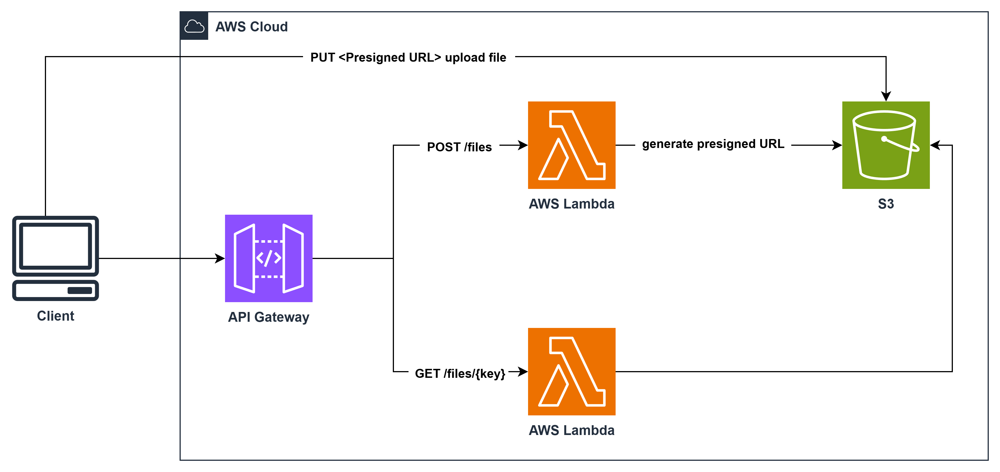
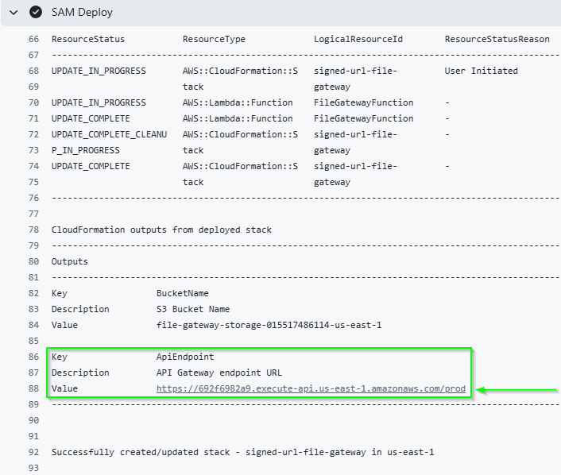

# Signed URL File Gateway (Serverless)

A lightweight, serverless file manager that uses **AWS API Gateway**, **Lambda**, and **S3** to securely upload and download files via pre-signed URLs.

## Deliverables

- **Google Document Link**: [Documentation Deliverable](https://docs.google.com/document/d/1ubZ1xzKd1IC5Cq_gNP1PGuYMARLVo68JqrOz77H9plY/edit?usp=sharing)
  _(This document contains the Architecture Diagram, detailed API explanation, and Proof of Functionality screenshots)_

## Architecture



1.  **POST /files**: Lambda generates a pre-signed **PUT** URL (valid 15 mins). Client uploads directly to S3.
2.  **GET /files/{key}**: Lambda generates a pre-signed **GET** URL (valid 1 hour) and returns an **HTTP 307 Temporary Redirect**. Client follows redirect to download from S3.

## IAM Role Setup (Critical for GitHub Actions)

To allow the GitHub Actions workflow to deploy this stack, you must create a **Least Privilege** IAM Role (`githubconnect`) with OIDC trust.

### 1. Create Identity Provider (If not exists)

- Go to IAM > Identity providers.
- Click in Add Provider
- Select "Provider type": OpenID Connect
- URL: `https://token.actions.githubusercontent.com`
- Audience: `sts.amazonaws.com`
- Click in Add Provider

For more information about this process see: [Configuring OpenID Connect in Amazon Web Services](https://docs.github.com/en/actions/how-tos/secure-your-work/security-harden-deployments/oidc-in-aws)

### 2. Create the Role

- Go to IAM > Roles
- Click in Create role
- Select "Web identity"
- Choose the identity provider you created in the previous step: `token.actions.githubusercontent.com`
- Select in Audience: `sts.amazonaws.com`
- Put in Github organization your github username eg: `joelrojas`
- Click in Next
- Put in Role name: `githubconnect`
- Select "Create role"

### 3. Add Permissions (Least Privilege Policy) to the Role `githubconnect`

Do **NOT** attach `AdministratorAccess`. Create a policy with only the needed permissions:

```json
{
  "Version": "2012-10-17",
  "Statement": [
    {
      "Effect": "Allow",
      "Action": [
        "cloudformation:*",
        "s3:*",
        "lambda:*",
        "apigateway:*",
        "iam:GetRole",
        "iam:PassRole",
        "iam:CreateRole",
        "iam:DeleteRole",
        "iam:AttachRolePolicy",
        "iam:DetachRolePolicy",
        "iam:DeleteRolePolicy",
        "iam:TagRole",
        "iam:UntagRole",
        "iam:PutRolePolicy"
      ],
      "Resource": "*"
    }
  ]
}
```

_(Note: In a strict production environment, you would scope `Resource` even further. For this lab, scoping to the specific services is sufficient)_

## Deployment

### Prerequisites

- AWS CLI installed and configured.
- AWS SAM CLI installed.
- Python 3.11 installed.

### Configure GitHub Repository Variables

Before running the workflows, you must configure the following **Variable** (NOT Secret) in your GitHub repository:

1.  Go to **Settings** > **Secrets and variables** > **Actions**.
2.  Click on the **Variables** tab (next to "Secrets").
3.  Click **New repository variable**.
4.  **Name**: `AWS_ACCOUNT_ID`
5.  **Value**: Your 12-digit AWS Account ID (e.g., `123456789012`).
6.  Click **Add variable**.

### Deploy with GitHub Actions

The deployment is fully automated via GitHub Actions but must be triggered manually.

1.  Navigate to the **Actions** tab in your GitHub repository.
2.  Select the **Deploy Infrastructure** workflow from the left sidebar.
3.  Click the **Run workflow** button.
4.  Wait for the implementation to complete (Green checkmark).

Once deployed, you can verify the environment by running the tests:

1.  Select the **Run Tests** workflow from the left sidebar.
2.  Click **Run workflow**.

**Settings (Configured in Workflow):**

- Stack Name: `signed-url-file-gateway`
- Region: `us-east-1`

## Verification

### 1. Manual Verification (cUrl)

**Step 1: Generate Pre-signed URL**

```bash
 curl --location 'https://<API_ID>.execute-api.us-east-1.amazonaws.com/prod/files' \
--header 'Content-Type: application/json' \
--data '{"filename": "image.jpg"}'
```

> the response will be: {"uploadUrl": "...", "objectKey": "...", "expiresIn": 900}

**Step 2: Upload File**

```bash
# Use the "uploadUrl" from Step 1
curl -X PUT -T "<path_to_file>" "<uploadUrl>"
```

**Step 3: Download File**

```bash
curl -v 'https://<API_ID>.execute-api.us-east-1.amazonaws.com/prod/files/<object_key>'
or
curl --location 'https://<API_ID>.execute-api.us-east-1.amazonaws.com/prod/files/<object_key>'
```

> Replace `<API_ID>` with your actual API ID (the first part of the URL).

> `<object_key>` is the key of the file you want to download, this is the key that was returned in the response of the upload request.

> You can find the URL of the API Gateway in the Outputs of the CloudFormation stack. The output name is `ApiEndpoint`.


